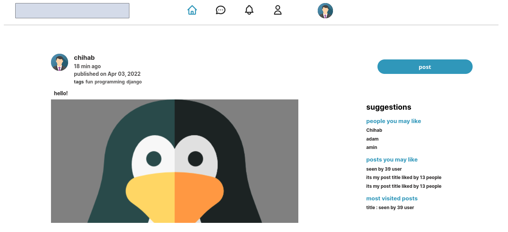
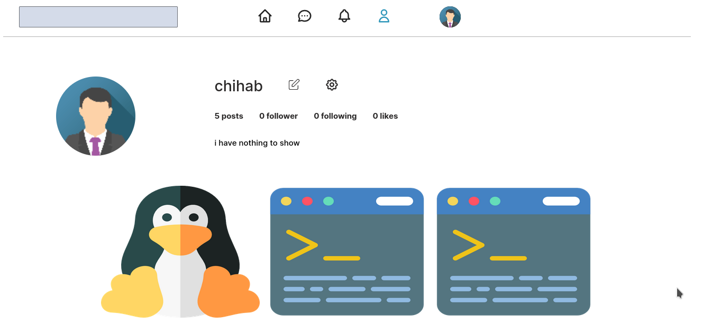
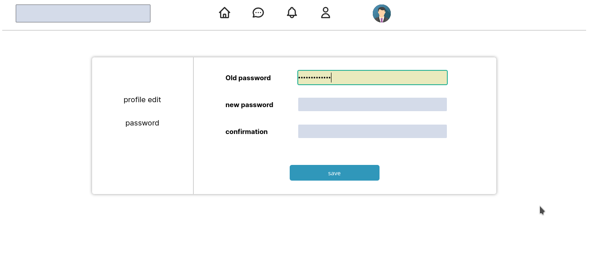
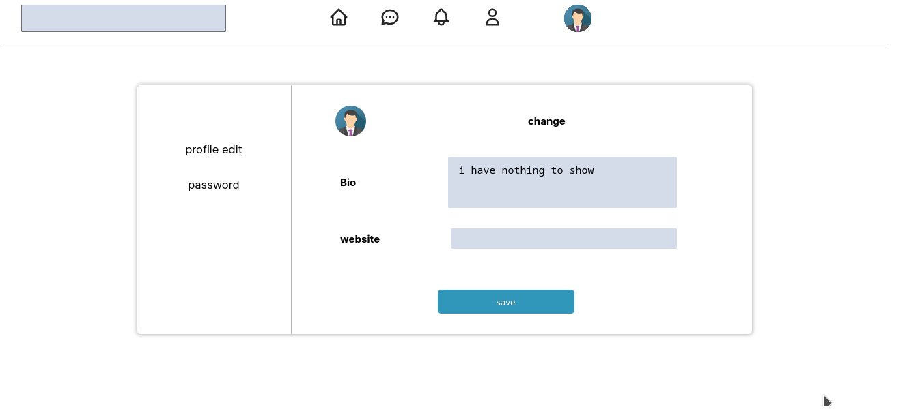

<<<<<<< HEAD
django social media website 
=======

django social media website

screenshots

alt text alt text alt text alt text

how to run it

1# pip install -r requirements.txt

you need to create an account to login

2# python manage.py createsuper user

to run the server

3# python manage.py runserver
>>>>>>> f774eac (adding some screenshots to the repo)

screenshots

how to run it 

1# pip install -r requirements.txt

you need to create an account to login

2# python manage.py createsuper user  

to run the server 

3# python manage.py runserver 
