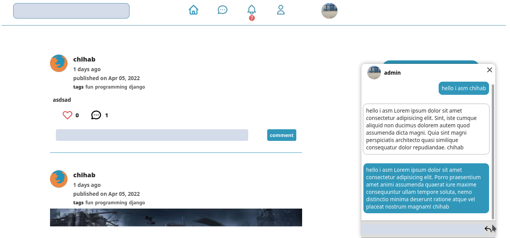
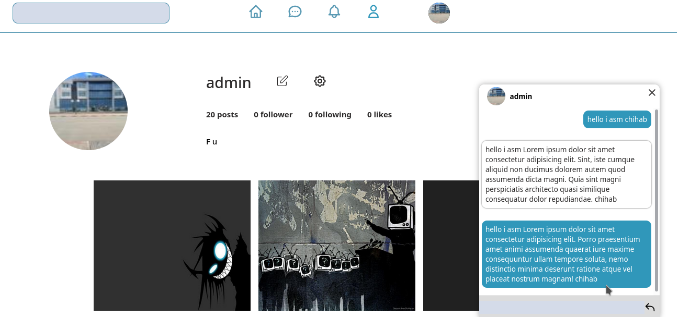
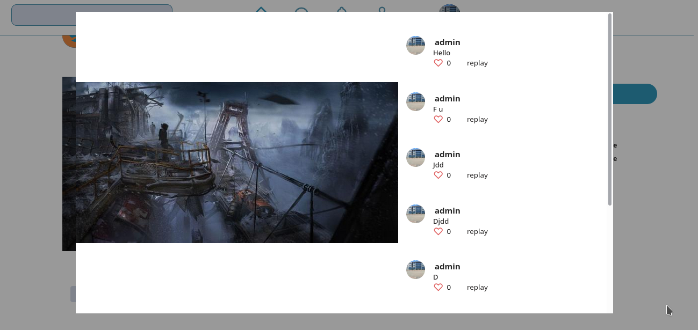

django social media website 

screenshots

how to run it 

1# pip install -r requirements.txt

you need to create an account to login

2# python manage.py createsuper user  

to run the server 

3# python manage.py runserver 
